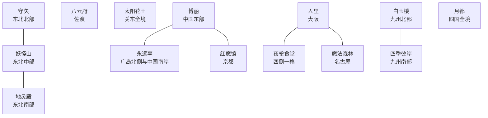

# 幻想乡日本分区草案 V4

所有幻想乡国家均使用四字标签，`HAKR` 为幻想乡结界盟约的宗主。

| 标签 | 国家 | 开局位置 |
|---|---|---|
| `HAKR` | 博丽结界领 | 中国东部及红魔馆西侧的一格京都边境 |
| `HITO` | 人里联合 | 大阪为首都；近畿主体、北信越、东海与中国内陆无飞地 |
| `YKMF` | 八云府 | 佐渡岛 |
| `EITR` | 永远亭月影领 | 中国南岸与广岛北侧 |
| `RDMK` | 雾之湖红魔领 | 京都与琵琶湖；近畿东缘一格补偿领 |
| `MFSR` | 魔法森林 | 名古屋附近 |
| `YSSK` | 夜雀食堂 | 大阪西侧一格 |
| `MRYA` | 守矢诸社 | 东北北部 |
| `YKYM` | 妖怪之山联盟 | 东北中南部山地，含原地灵殿领 |
| `CHRD` | 地灵殿辖区 | 北信越原人里领地 |
| `KZNH` | 太阳花田 | 关东全境；正常 `unrecognized` 国家 |
| `BYKR` | 白玉楼 | 九州北部 |
| `HIGN` | 四季彼岸 | 九州南部与琉球 |
| `MTOU` | 月都前哨 | 四国全境 |
| `TENG` | 天界 | 北方四岛 |
| `MKAI` | 魔界 | 北海道主体 |

## 实施原则

- 人里不再在中国保留飞地；大阪所在近畿省份明确由人里持有。
- 八云府从中国北侧撤出，改为佐渡岛的单一岛屿政权。
- 名古屋南岸仍归人里；魔法森林仅取名古屋附近一格。夜雀食堂同样压缩为大阪以西一格。
- 博丽取得红魔馆西侧边界省份；红魔馆获得近畿东缘一格作为补偿。
- 地灵殿的东北旧领并入妖怪山；地灵殿改接收北信越原属人里的两格。
- 关东、四国和九州南北划分保持 V3 的完整性。
