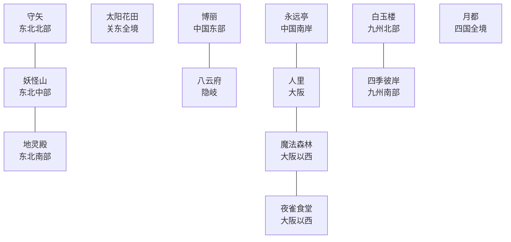

# 幻想乡日本分区草案 V3

所有幻想乡国家均使用四字标签，避免占用原版国家标签。`HAKR` 为幻想乡结界盟约的宗主。

| 标签 | 国家 | 开局位置 |
|---|---|---|
| `HAKR` | 博丽结界领 | 中国东部 |
| `HITO` | 人里联合 | 大阪为首都；近畿主体、北信越、东海与中国内陆 |
| `YKMF` | 八云府 | 中国北侧的隐岐岛屿投射 |
| `EITR` | 永远亭月影领 | 中国南岸 |
| `RDMK` | 雾之湖红魔领 | 京都与琵琶湖 |
| `MFSR` | 魔法森林 | 大阪以西的近畿山林 |
| `YSSK` | 夜雀食堂 | 大阪以西的人妖往来节点 |
| `MRYA` | 守矢诸社 | 东北北部 |
| `YKYM` | 妖怪之山联盟 | 东北中部山地 |
| `CHRD` | 地灵殿辖区 | 东北南部，妖怪山南麓 |
| `KZNH` | 太阳花田 | 关东全境；正常 `unrecognized` 国家 |
| `BYKR` | 白玉楼 | 九州北部 |
| `HIGN` | 四季彼岸 | 九州南部与琉球 |
| `MTOU` | 月都前哨 | 四国全境 |
| `TENG` | 天界 | 北方四岛 |
| `MKAI` | 魔界 | 北海道主体 |

## 实施原则

- “冥界南北分”落实在九州：白玉楼位于北部，四季彼岸位于南部；琉球归彼岸。
- 关东不再保留白玉楼或彼岸的飞地，完整由太阳花田统治，且不是原住民政权。
- 八云府只占含隐岐的单一游戏省份；该省份在地图数据中带有沿岸部分，作为八云隙间的现实投射解释。
- 魔法森林与夜雀食堂均从东海撤出，迁到大阪西侧，以人里为日常交通中心。
