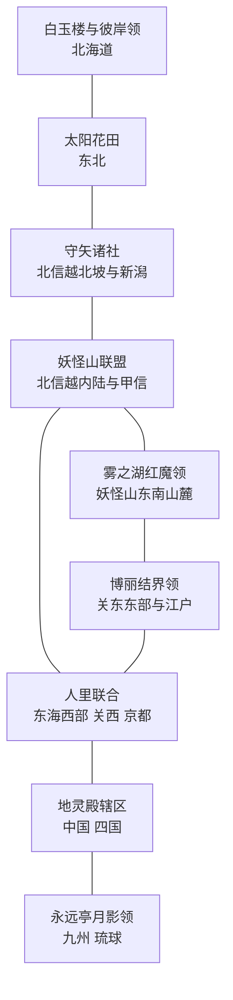

# 全日本幻想乡分区草案 V1

## 目标

日本全境在开局即属于幻想乡诸势力，不保留以现实日本为主题的残余国家。分区以官方场景中“博丽边境—人里—妖怪山—守矢／雾之湖”的相对关系为核心；北海道、东北、中国四国、九州则作为扩张后的外围领地处理。

本版是领土与角色归属草案，不改变角色肖像，也不在本版新增角色。省份应在下一步按本表的州区方向切分，核心地区必须按省份而非整州切分。

## 开局国家

| 标签 | 国家 | 地图位置与规模 | 现有角色主归属 |
| --- | --- | --- | --- |
| `GSK` | 博丽结界领 | 关东东部；江户与博丽神社所在的边境领，2–3 个核心省份 | 博丽灵梦、八云紫、宇佐见堇子 |
| `HRT` | 人里联合 | 东海西部、关西、京都；人口与手工业主体，约 10–14 个省份 | 上白泽慧音、秋穰子、依神女苑；藤原千花、四宫辉夜、早坂爱可留在其人类政治圈 |
| `YKM` | 妖怪山联盟 | 北信越内陆与甲信山地，3–5 个山地省份 | 射命丸文、河城荷取、伊吹萃香 |
| `MRY` | 守矢诸社 | 北信越北坡至新潟一线，2–3 个相连省份；与妖怪山接壤 | 东风谷早苗、八坂神奈子、洩矢诹访子 |
| `RDM` | 雾之湖红魔领 | 东海东部、妖怪山东南山麓，2–3 个湖区与丘陵省份 | 蕾米莉亚、芙兰朵露、十六夜咲夜、帕秋莉、红美铃 |
| `KZM` | 太阳花田 | 东北；农业、花卉与妖精聚落组成的北方外环，约 8–10 个省份 | 风见幽香 |
| `HKN` | 白玉楼与彼岸领 | 北海道；雪原、港口与冥界通道组成的北方孤岛领，约 12–15 个省份 | 西行寺幽幽子、魂魄妖梦、四季映姬、小野塚小町 |
| `CHT` | 地灵殿辖区 | 中国与四国；地热、矿业、山谷和濑户内航道组成的西部领，约 8–10 个省份 | 古明地觉、古明地恋；比那名居天子、永江衣玖可作为关联角色 |
| `EIT` | 永远亭月影领 | 九州与琉球；医药、竹林、对外贸易及月都前哨组成的南方领，约 10–12 个省份 | 蓬莱山辉夜、八意永琳、铃仙、因幡帝、藤原妹红 |

魔理沙和爱丽丝不单列国家。她们的魔法森林位于人里与妖怪山之间，先作为 `HRT` 境内但拥有独立建筑、社团与事件的自治地区。

## 地图骨架

## 必须保持的核心邻接

1. `GSK` 与 `HRT` 必须有直接边界，用于妖怪兽道和人里往来。
2. `YKM` 与 `MRY` 必须直接相邻；守矢领应表现为妖怪山北坡的神权自治地，新潟是其山下对外口岸。
3. `RDM` 必须贴着 `YKM`，并位于通向 `GSK` 的一侧；雾之湖作为红魔领的首府地标。
4. `HRT` 与 `YKM` 的边界应留出一块魔法森林特殊地区；永远亭在 `HRT` 南缘或西缘，以建筑和日志实现，不需要领土飞地。
5. 北海道、东北、九州及琉球可作为通过结界扩张获得的外围领地，因此不要求与核心五国完全符合原作的物理距离。

## 州区切分指引

| 原版州区 | 分配方向 |
| --- | --- |
| 北海道 | `HKN` 全部取得，保留少量港口省份作白玉楼对外通道 |
| 东北 | `KZM` 为主；最南端可留给 `GSK` 作为结界外缘缓冲 |
| 关东 | `GSK` 为主，江户必须归 `GSK`；西南山地可留给 `RDM` 或作为魔法森林特殊地区 |
| 北信越 | `YKM` 取得内陆山地；`MRY` 取得北坡、新潟与沿海口岸 |
| 东海 | 西部归 `HRT`；东部山麓、湖区归 `RDM`；两者之间留出魔法森林地带 |
| 关西与京都 | `HRT`，命莲寺、神灵庙均作为其国内宗教内容 |
| 中国与四国 | `CHT`，强调地热、矿业、温泉与濑户内海航运 |
| 九州与琉球 | `EIT`，琉球作为月影领的离岛前哨而非飞地错误 |

## 暂不独立的势力

- 命莲寺、神灵庙：`HRT` 的宗教组织与日志内容。
- 魔法森林：`HRT` 与 `YKM` 边界的自治地，配置雾雨魔理沙、爱丽丝·玛格特洛依德。
- 地底、旧地狱、月之都、冥界、彼岸：通过 `CHT`、`EIT`、`HKN` 的特殊建筑和异界入口体现。
- 天界：先作为 `CHT` 的事件链和天子、衣玖角色内容；不占领现实地图。

