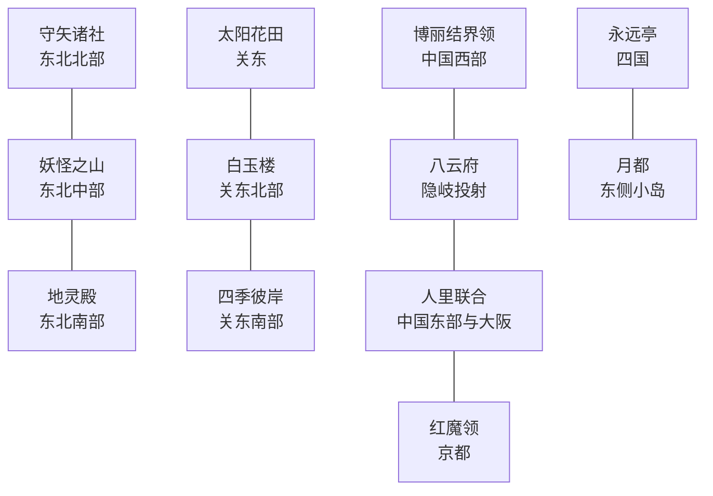

# 幻想乡日本分区草案 V2

本版将全部幻想乡国家统一使用四字标签，避免覆盖或混淆原版三字国家标签。博丽作为结界盟约宗主，其余势力开局为附庸。

| 标签 | 国家 | 开局位置与定位 |
|---|---|---|
| `HAKR` | 博丽结界领 | 中国西部的结界山脊；幻想乡叙事中的东侧边界 |
| `HITO` | 人里联合 | 中国东部、近畿（首都大阪）、北信越与东海主体 |
| `YKMF` | 八云府 | 中国北侧、含隐岐投射的小型边境领 |
| `RDMK` | 雾之湖红魔领 | 京都与琵琶湖 |
| `MFSR` | 魔法森林 | 东海山林 |
| `YSSK` | 夜雀食堂 | 东海的人妖往来节点 |
| `MRYA` | 守矢诸社 | 东北北部 |
| `YKYM` | 妖怪之山联盟 | 东北中部山地 |
| `CHRD` | 地灵殿辖区 | 东北南部，紧邻妖怪山南麓 |
| `KZNH` | 太阳花田 | 关东的小型花田领，不使用原住民政权类型 |
| `BYKR` | 白玉楼 | 关东北部冥界投射 |
| `HIGN` | 四季彼岸 | 关东南部、九州与琉球的南方彼岸投射 |
| `EITR` | 永远亭月影领 | 四国主体 |
| `MTOU` | 月都前哨 | 四国东侧的小岛投射 |
| `TENG` | 天界 | 北方四岛 |
| `MKAI` | 魔界 | 北海道主体 |

## 关系与实施原则

- `HAKR` 维持幻想乡结界盟约的宗主与阵营领袖地位。
- 东北采用守矢—妖怪山—地灵殿的北、中、南连续结构；地灵殿不再留在北信越。
- 关东将冥界明确拆为白玉楼与四季彼岸，太阳花田独立且为正常 `unrecognized` 国家。
- 四国主体留给永远亭，月都只保留东侧的岛屿投射；岛屿在地图省份层面与主岛共享边界时，以异界前哨解释。
- 隐岐在地图数据中和中国沿岸省份属于同一游戏省份，因此八云府会保有一小段沿岸投射，避免产生不可实现的纯岛屿飞地。
