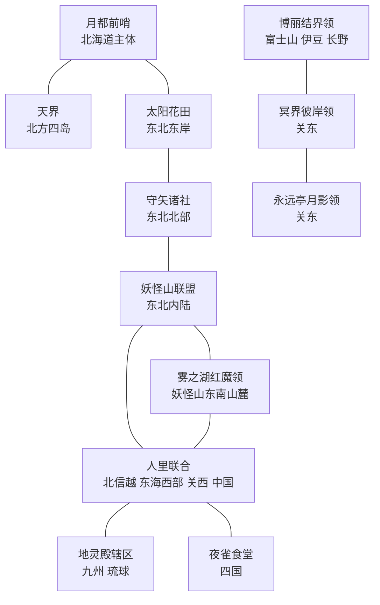

# 全日本幻想乡分区草案 V1

## 目标

日本全境在开局即属于幻想乡诸势力，不保留以现实日本为主题的残余国家。分区以官方场景中“博丽边境—人里—妖怪山—守矢／雾之湖”的相对关系为核心；北海道、东北、中国四国、九州则作为扩张后的外围领地处理。

本版已落实领土、附庸与阵营骨架；米斯蒂娅使用角色生成器生成了可替换 demo 肖像。核心地区按省份而非整州切分。

## 开局国家

| 标签 | 国家 | 地图位置与规模 | 现有角色主归属 |
| --- | --- | --- | --- |
| `GSK` | 博丽结界领 | 富士山、伊豆与邻接的长野山地 | 博丽灵梦、八云紫、宇佐见堇子 |
| `MFS` | 魔法森林 | 山梨与静冈方向的森林地带，2 个相连省份 | 雾雨魔理沙、爱丽丝·玛格特洛依德 |
| `HRT` | 人里联合 | 北信越、东海西部、关西与中国；人口与手工业主体 | 上白泽慧音、秋穰子、依神女苑；藤原千花、四宫辉夜、早坂爱可留在其人类政治圈 |
| `YKM` | 妖怪山联盟 | 东北内陆山地 | 射命丸文、河城荷取、伊吹萃香 |
| `MRY` | 守矢诸社 | 东北北部山地；与妖怪山接壤 | 东风谷早苗、八坂神奈子、洩矢诹访子 |
| `RDM` | 雾之湖红魔领 | 京都与琵琶湖周边，4 个相连省份 | 蕾米莉亚、芙兰朵露、十六夜咲夜、帕秋莉、红美铃 |
| `KZM` | 太阳花田 | 东北太平洋东岸的小型农业、花卉与妖精领 | 风见幽香 |
| `HKN` | 冥界彼岸领 | 关东核心地区；冥界、彼岸与白玉楼的现实投射 | 西行寺幽幽子、魂魄妖梦、四季映姬、小野塚小町 |
| `CHT` | 地灵殿辖区 | 九州与琉球；火山、地热、矿业与异界入口组成的南方领 | 古明地觉、古明地恋 |
| `EIT` | 永远亭月影领 | 关东的医药、竹林与月影领 | 蓬莱山辉夜、八意永琳、铃仙、因幡帝、藤原妹红 |
| `MTC` | 月都前哨 | 北海道主体；月都在现实世界的北方前哨 | 月都相关内容后续补充 |
| `TEN` | 天界 | 北方四岛；天子与衣玖的海上天界投射 | 比那名居天子、永江衣玖 |
| `YSS` | 夜雀食堂 | 四国全境；夜间食肆、旅人集散与音乐文化的岛屿领 | 米斯蒂娅·萝蕾拉 |

魔理沙和爱丽丝不单列国家。她们的魔法森林位于人里与妖怪山之间，先作为 `HRT` 境内但拥有独立建筑、社团与事件的自治地区。

## 地图骨架

## 必须保持的核心邻接

1. `GSK` 与 `HRT` 必须有直接边界，用于妖怪兽道和人里往来。
2. `YKM` 与 `MRY` 必须直接相邻；守矢领应表现为妖怪山北坡的神权自治地，新潟是其山下对外口岸。
3. `RDM` 必须贴着 `YKM`，并位于通向 `GSK` 的一侧；雾之湖作为红魔领的首府地标。
4. `HRT` 与 `YKM` 的边界应留出一块魔法森林特殊地区；永远亭在 `HRT` 南缘或西缘，以建筑和日志实现，不需要领土飞地。
5. 北海道、东北、九州及琉球可作为通过结界扩张获得的外围领地，因此不要求与核心五国完全符合原作的物理距离。

## 州区切分指引

| 原版州区 | 分配方向 |
| --- | --- |
| 北海道 | 主体归 `MTC`；北方四岛归 `TEN` |
| 东北 | `YKM`、`MRY` 分占内陆；`KZM` 只保留太平洋东岸小块花田 |
| 关东 | `HKN`、`EIT` 分占主体；千叶归 `HKN` |
| 北信越 | `HRT` 为主；与伊豆相接的一块长野山地归 `GSK` |
| 东海 | 西部归 `HRT`；富士山归 `GSK`，山梨—静冈方向为 `MFS` |
| 关西与京都 | 关西归 `HRT`；京都与琵琶湖归 `RDM` |
| 中国与四国 | 中国归 `HRT`，四国整体归 `YSS`，避免将岛内切成飞地 |
| 九州与琉球 | `CHT`，作为地底与旧地狱的火山、地热入口 |

## 暂不独立的势力

- 命莲寺、神灵庙：`HRT` 的宗教组织与日志内容。
- 魔法森林：`HRT` 与 `YKM` 边界的自治地，配置雾雨魔理沙、爱丽丝·玛格特洛依德。
- 地底、旧地狱、月之都、冥界、彼岸：通过 `CHT`、`EIT`、`HKN` 的特殊建筑和异界入口体现。
- 天界：北方四岛的独立小领，由 `TEN` 体现。
